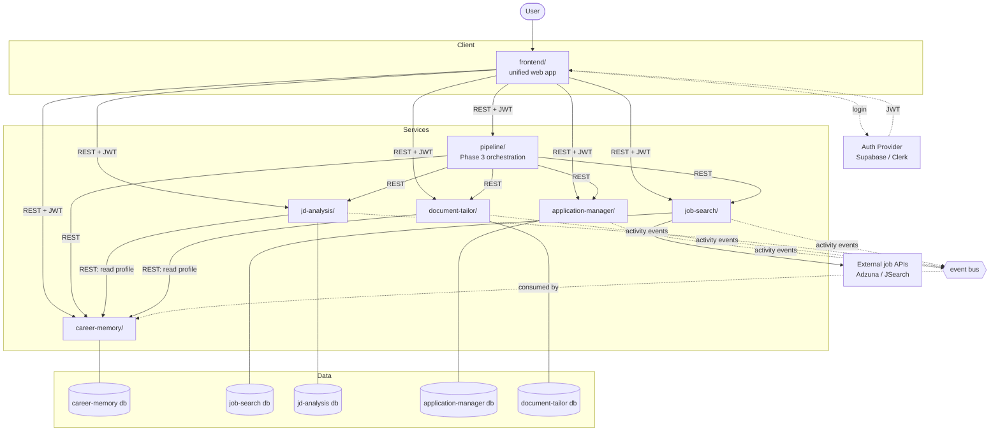

# Architecture

How LazyCareer fits together. Every claim here links to the decision that made it — this page describes, it does not decide.

**Read time: ~3 minutes.**

## Shape

One frontend. Many independent backend services. Each service owns its own database. Nothing shares tables.



Solid arrows are synchronous REST. Dotted arrows are asynchronous events and auth.

## Services

| Service | Responsibility | Owns | Depends on | Phase |
|---|---|---|---|---|
| `shared/` | Types, schema validators, auth helpers, UI kit. The only home for agreed data shapes. | nothing (library) | — | 0 |
| `frontend/` | The one user-facing app. A route/section per module. | UI state only | every service | 1+ |
| `career-memory/` | Living structured profile + append-only activity log | profile, skills, experience, projects, education, certifications, activity | auth | 1 |
| `job-search/` | Job discovery via external APIs + manual entry | saved/bookmarked jobs, search criteria | external job APIs | 1 |
| `jd-analysis/` | JD breakdown, fit score, gap summary | analyses, fit scores | career-memory (read) | 1 |
| `application-manager/` | Procedure guides + application stage tracking | applications, stages, tasks, deadlines | career-memory (write via events) | 2 |
| `document-tailor/` | Resume / cover letter / post generation | generated docs, version history | career-memory (read), jd-analysis (read) | 2 |
| `pipeline/` | Orchestration + dashboard. Calls module APIs, reimplements nothing. | cross-module session context | all modules | 3 |
| `app-intelligence/` | Response analytics, aggregate skill gap | derived analytics | application-manager history | 4 |
| `market-intelligence/` | Market trends, 30/60/90 strategy | market data | external data, career-memory | 4 |

Services talk **only over REST**. No service reads another service's database — see [ADR 0002](decisions/0002-storage-model.md) and the spec's database-per-service rule.

## Auth

One provider, one token, verified independently everywhere.

```
User logs in once
  → auth provider issues a JWT
    → frontend attaches it to every request, to every service
      → each service verifies it independently (no shared session store, no auth gateway)
```

The frontend is unified; the backends stay decoupled. Only the UI layer is shared. See [ADR 0006](decisions/0006-auth-and-ui-architecture.md).

## Data Flow: the passive update path

This is the mechanism that makes Career Memory "automatic" — the product's central promise.

```
User completes an action in any module
  (e.g. moves an application to "Interview" in application-manager)
      │
      ├─ that module writes to its own database   ← its own concern
      │
      └─ that module emits an activity event      ← fire-and-forget
             │
             ▼
         event bus
             │
             ▼
      career-memory consumes it
             │
             ▼
      appended to activity_log
```

Two properties make this safe:

- **Append-only.** `activity_log` is event-sourced; entries are never mutated.
- **Idempotent.** Every event carries a client-generated `eventId`. Duplicate deliveries are normal in event-driven systems, so the receiver dedupes on a unique index. See [ADR 0005](decisions/0005-api-conventions.md).

The emitting module does not care whether Career Memory is up. That decoupling is the point.

## Data Flow: reading the profile

Modules that need profile data call Career Memory's REST API — they never query its database, and never keep their own copy of profile data.

```
jd-analysis      → GET career-memory /api/v1/users/:userId/skills      → fit score
document-tailor  → GET career-memory /api/v1/users/:userId/experience  → tailored resume
```

Career Memory is the source of truth for who the user is. Markdown/JSON profile exports are **generated on request**, never stored as the authority — see [ADR 0002](decisions/0002-storage-model.md).

## Intake

Career Memory accepts five input sources, each with different trust and refresh behaviour ([ADR 0003](decisions/0003-input-sources.md)):

| Source | Refresh | Note |
|---|---|---|
| Chat | on user message | conversational intake, not a static form |
| Resume files | on upload | PDF / DOCX / TeX parsed to structured entries |
| Logging files | on upload | project/progress docs appended to the log |
| GitHub | **live** — webhooks + background polling | official API, safe to keep live |
| LinkedIn | **manual only** — user clicks "Update" | no public API; polling risks ToS violation and account bans |

The LinkedIn constraint is a hard rule, not a preference.

## Phase 3: the pipeline

`pipeline/` is the orchestration layer that turns the modules into a product. It owns cross-module continuity — the `{ userId, jobId, applicationId }` context that persists as a user moves Search → JD Analysis → Procedure Guide → Tracker → Document Tailor.

It **calls** module APIs. It does not reimplement module logic, and it does not own module data.

## Repo layout

Monorepo with workspaces — one repo, independent deploys (own Dockerfile / CI job per folder). Not submodules, not polyrepos. See [ADR 0007](decisions/0007-repo-structure.md).

The monorepo unifies source control, not deployment.

## Conventions in force

Full detail in the ADRs; the operative rules are listed in [`.agents/rules.md`](../.agents/rules.md).

- REST/JSON everywhere, URI path versioning — [ADR 0005](decisions/0005-api-conventions.md)
- UUIDv4 for every ID crossing a service boundary — [ADR 0004](decisions/0004-id-format.md)
- One shared error envelope, defined in `shared/` — [ADR 0005](decisions/0005-api-conventions.md)
- Relational tables for queryable data, JSONB only for opaque payloads — [ADR 0002](decisions/0002-storage-model.md)

## Not decided yet

Tech stack, event bus implementation, deploy target confirmation, and team ownership are all open. See [`open-questions.md`](open-questions.md) before assuming any of them.
